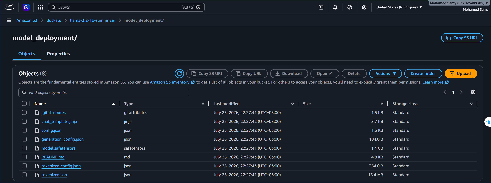

### Bedrock Deployment
Use AWS Bedrock with custom imported models.

1. Upload your model to S3
```bash
hf download MohamedQiqa/Llama-3.2-1B-QLoRA-Summarizer
```
- The model should be imported in `code/bedrock/model_deployment` folder.
- Create S3 Bucket in us-east-1 region, and upload the model to S3 via https://us-east-1.console.aws.amazon.com/s3/upload/llama-3.2-1b-summrizer?region=us-east-1

---
2. Import Model to Bedrock
- Go to bedrock service on us-east-1 then imported models or follow this link https://us-east-1.console.aws.amazon.com/bedrock/home?region=us-east-1#/import-models/create
- Model name: llama-3.2-1b-summarizer
- Model import source: Choose S3 location that your model is located in
- Tags: Add any tags as needed
- Click Import model.
- that's it. We can consider this model as deployed. Everything else is handled by AWS. You don't need to worry about what's going to happen from now.
---
3. Then Select the model and copy Model ARN and past it in MODEL_ARN in .env file.

4. Test with client:
```bash
python code/bedrock/bedrock_client.py
```
> This is one of the easiest deployment tasks. It is very straight forward.  You don't need to configure a server or some GPUs. I think this is one of the easiest ways to deploy a model. And yeah you don't need to worry about scaling, infrastructure, or any other thing. It is all handled by AWS.