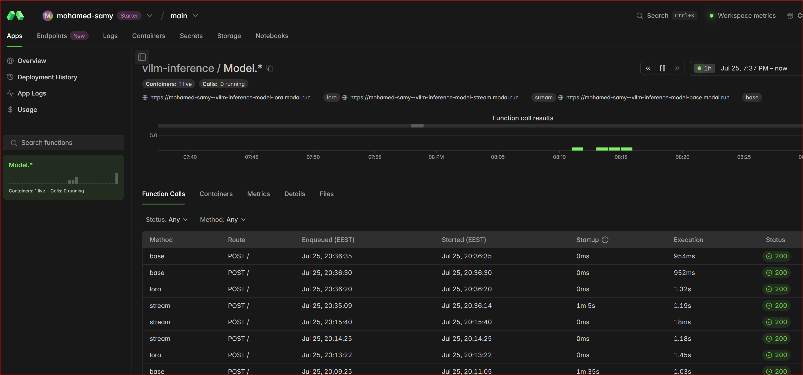
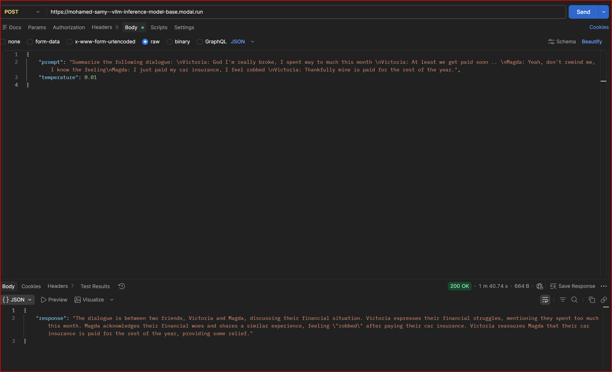
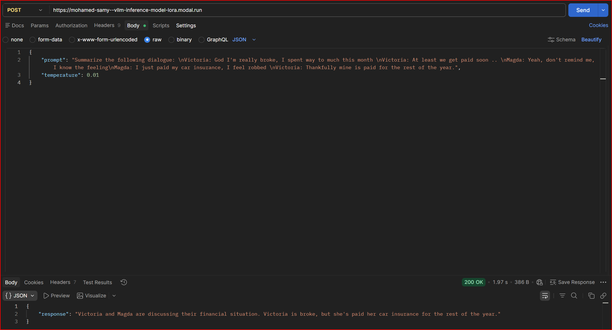
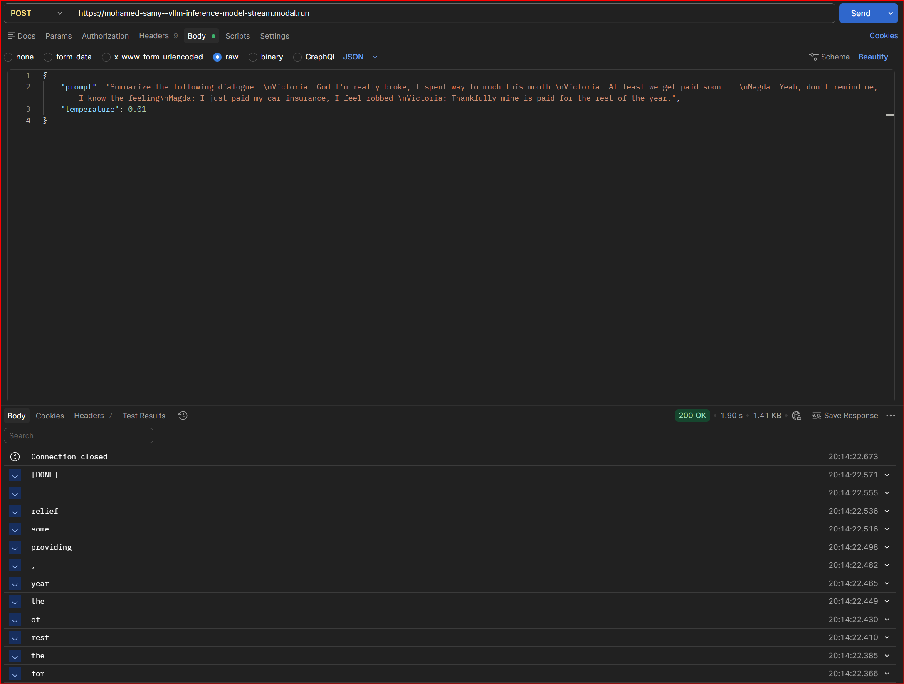

### Modal Deployment

Deploy vLLM with LoRA adapters on Modal's serverless GPU infrastructure.

**Deploy:**

```bash
modal setup
modal deploy code/modal/server.py
```

Here's the output that you should see:
```
✓ Created objects.
├── 🔨 Created function Model.*.
├── 🔨 Created Web Function URL for Model.lora
├── 🔨 Created Web Function URL for Model.base
└── 🔨 Created Web Function URL for Model.stream
✓ App deployed! 🎉
```

We can start sending requests to it using the provided URLs via Postman or curl (with the deployed URL):
```bash
curl -X POST https://<your-modal-url>-lora.modal.run \
     -H "Content-Type: application/json" \
     -d '{
    "prompt": "Summarize the following dialogue: \nVictoria: God I'\''m really broke, I spent way to much this month \nVictoria: At least we get paid soon .. \nMagda: Yeah, don'\''t remind me, I know the feeling\nMagda: I just paid my car insurance, I feel robbed \nVictoria: Thankfully mine is paid for the rest of the year.",
    "temperature": 0.01
    }'
```





Note: Replace the URL with your actual deployed URL from the output.