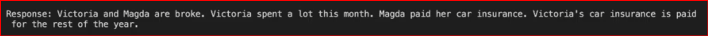
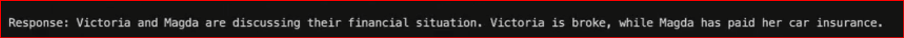

### Runpod Serverless

Client for Runpod's serverless vLLM endpoints with OpenAI-compatible API.

**Test with client:**

```bash
cd code/runpod

# Chat with model
python client_openai.py --prompt "What is serverless computing?"

# Streaming response
python client_openai.py --stream --prompt "Write a haiku"

# List available models
python client_openai.py --list-models
```

Without chat template


With Chat template


The summarization style is slightly shorter and closer to the training data format. The difference comes from the chat template — the model was trained with it, so removing it may change the model's behavior. That's why we prefer to keep it.