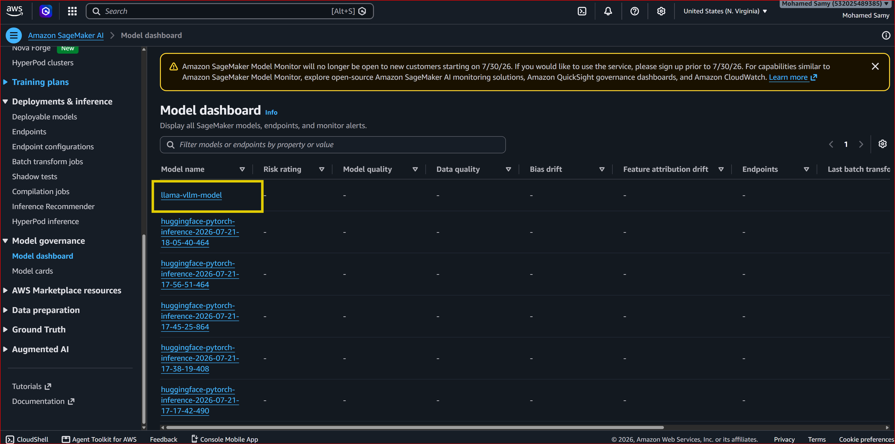
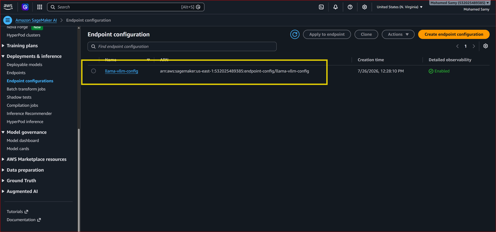
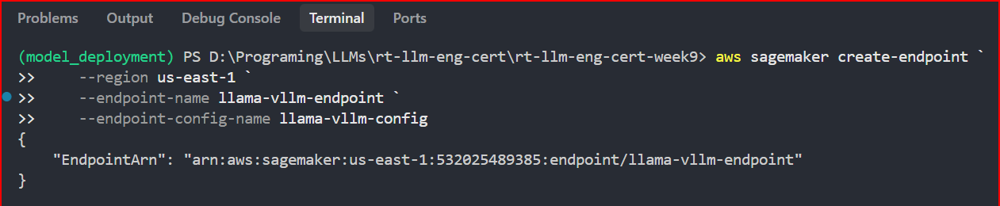
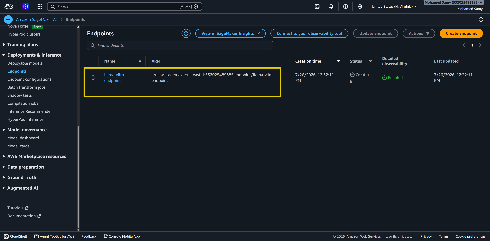

### SageMaker Deployment

Deploy vLLM on AWS SageMaker using pre-built containers.

**Create model:**

```bash
aws sagemaker create-model \
    --model-name llama-vllm-model \
    --primary-container '{
        "Image": "763104351884.dkr.ecr.us-east-1.amazonaws.com/vllm:0.11-gpu-py312-cu129-ubuntu22.04-sagemaker-v1",
        "Environment": {
            "SM_VLLM_MODEL": "MohamedQiqa/Llama-3.2-1B-QLoRA-Summarizer",
            # "HUGGING_FACE_HUB_TOKEN": "your-hf-token-here"   # -> use it if your model is private on HF not public
        }
    }' \
    --execution-role-arn arn:aws:iam::532025489385:role/sagemaker-training-role
```
Use this in your CLI
```bash
aws sagemaker create-model `
    --model-name llama-vllm-model `
    --region us-east-1 `
    --primary-container '{\"Image\": \"763104351884.dkr.ecr.us-east-1.amazonaws.com/vllm:0.11-gpu-py312-cu129-ubuntu22.04-sagemaker-v1\", \"Environment\": {\"SM_VLLM_MODEL\": \"MohamedQiqa/Llama-3.2-1B-QLoRA-Summarizer\"}}' `
    --execution-role-arn arn:aws:iam::532025489385:role/sagemaker-training-role
```

---
**Create endpoint config:**
```bash
aws sagemaker create-endpoint-config \
    --endpoint-config-name llama-vllm-config \
    --production-variants "[{
        \"VariantName\": \"AllTraffic\",
        \"ModelName\": \"llama-vllm-model\",
        \"InstanceType\": \"ml.g6.2xlarge\",
        \"InitialInstanceCount\": 1,
        \"ContainerStartupHealthCheckTimeoutInSeconds\": 900
    }]"
```
Use this in your CLI
```bash
aws sagemaker create-endpoint-config `
    --region us-east-1 `
    --endpoint-config-name llama-vllm-config `
    --production-variants '[{\"VariantName\": \"AllTraffic\", \"ModelName\": \"llama-vllm-model\", \"InstanceType\": \"ml.g6.2xlarge\", \"InitialInstanceCount\": 1, \"ContainerStartupHealthCheckTimeoutInSeconds\": 900}]'
```


**Create endpoint:**
```bash
aws sagemaker create-endpoint `
    --region us-east-1 `
    --endpoint-name llama-vllm-endpoint `
    --endpoint-config-name llama-vllm-config
```

---


> **NOTE:** Just keep in mind that once this turns into successful, you'll start paying for the endpoint even if you are not using it, so make sure to delete it after you're done with it, So please be careful, so make sure to delete anyendpoints that you're not using whenever you're using SageMaker. 

---

**Test with client:**
```bash
python code/sagemaker/client.py
```
> **NOTE:** SageMaker endpoints take ~5-10 minutes to become InService.

**Cleanup (important!):**
```bash
aws sagemaker delete-endpoint --endpoint-name llama-vllm-endpoint
aws sagemaker delete-endpoint-config --endpoint-config-name llama-vllm-config
aws sagemaker delete-model --model-name llama-vllm-model
```